# OnlineExamSystem

With the Covid-19 situation, it's become difficult for the institutions to hold offline examinations. It's the need of the time to shift to online mode in this new normal so as to evaluate students and allocate grades on the basis of knowledge of the subject. In this world of evolving technology, it would not be a big deal to shift the examination mode to online mode and be able to conduct examinations seamlessly.

# Main Features :

# Admin
  1) Schedule and finalise examinations
  2) Preview and test a created examination
  3) Manage Question Bank
  4) Manage Users in the system
  5) Edit Results
 
# Faculty
  1) Manage Question Bank
  2) Edit Results

# Students
  1) Attempt Examination
  2) View Marks

# Technology Stack
  FrontEnd : HTML, CSS + BootStrap, JS
  BackEnd : NodeJS
  DataBase : Sqlite3
  
# Screenshots of Working Project

1) Home Page
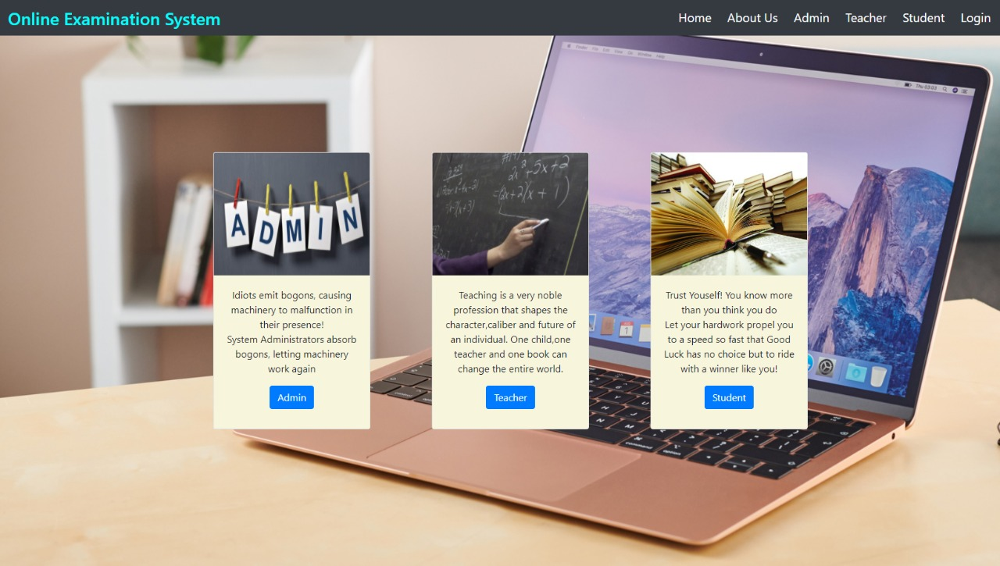

2) Login
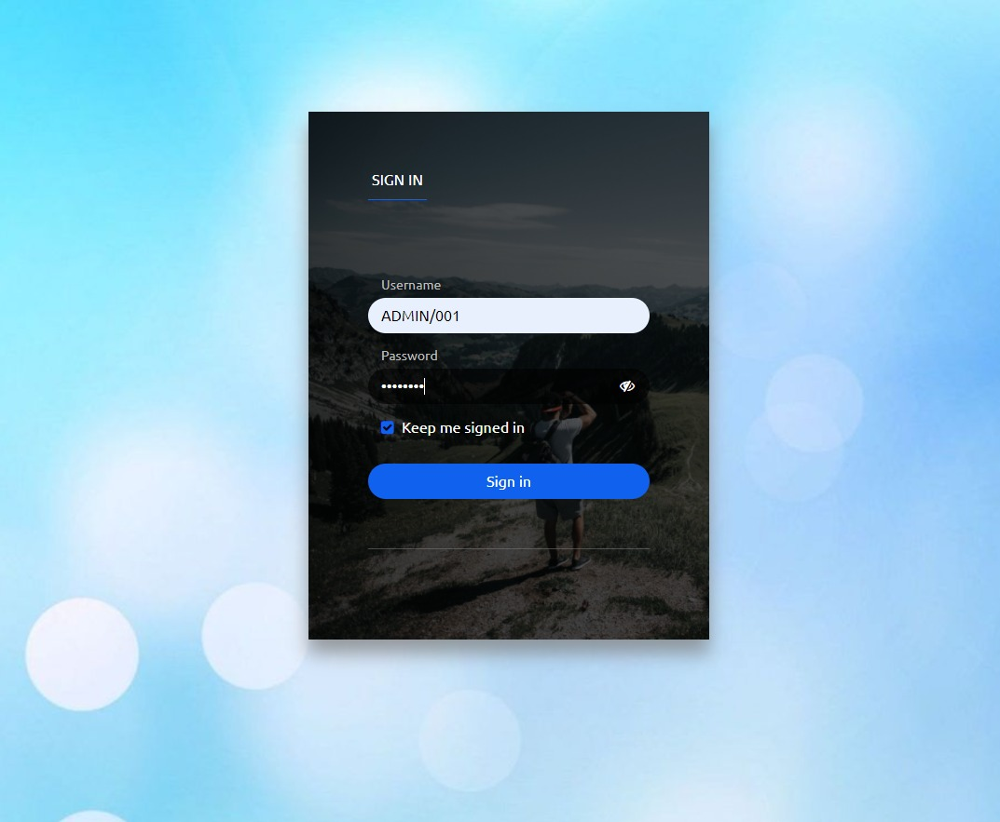

3) Admin Portal
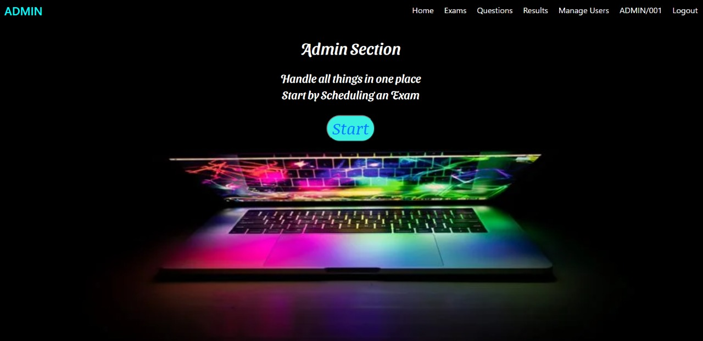

4) Manage Examinations
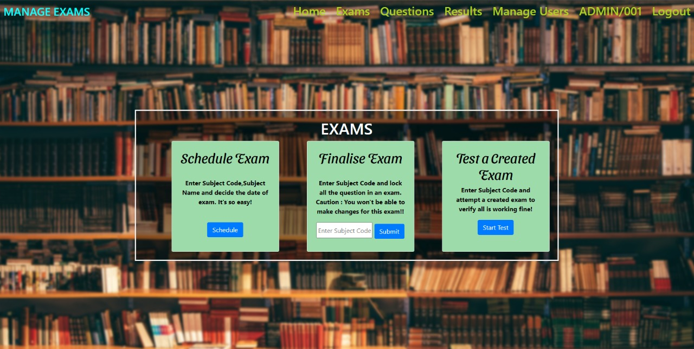

5) Schedule Examination
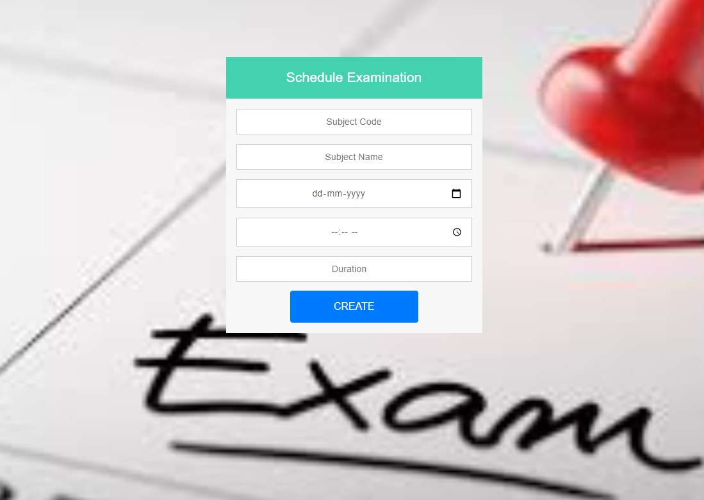

6) Manage Users
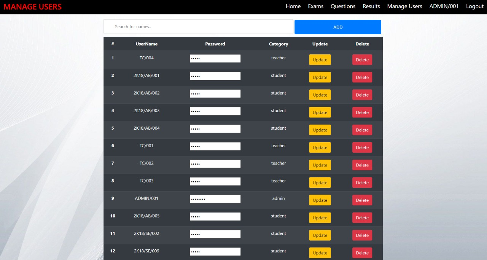

7) Manage Results
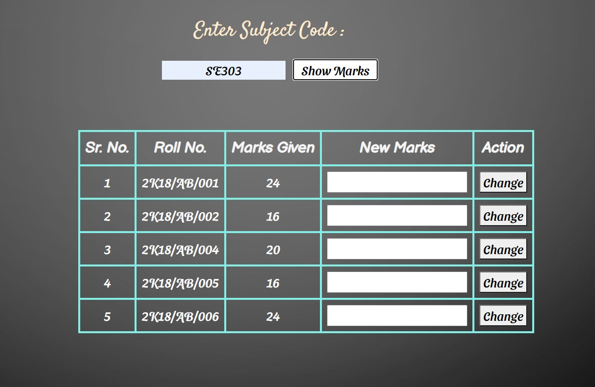

8) Manage Questions
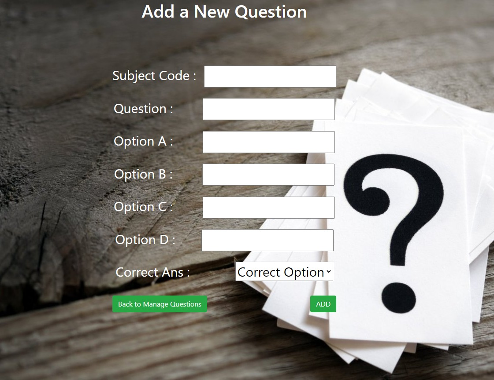
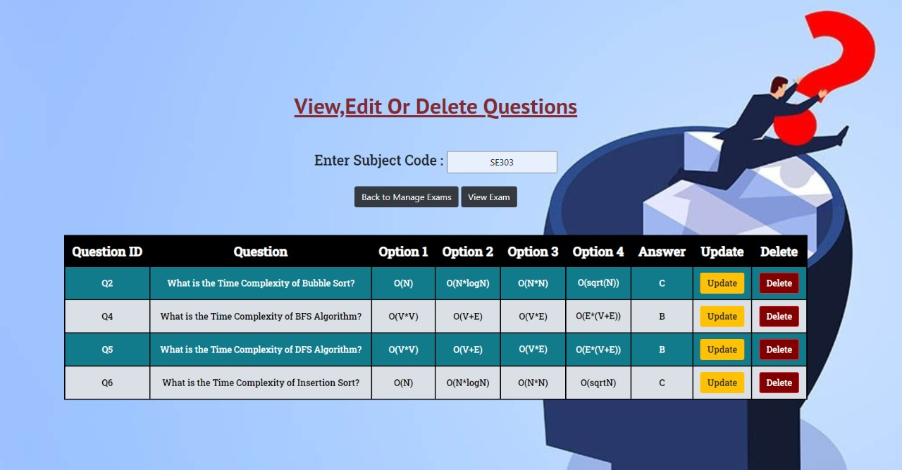

9) Teacher Portal

10) Student Portal
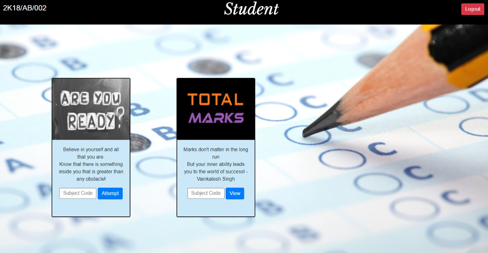

11) Attempt Examination
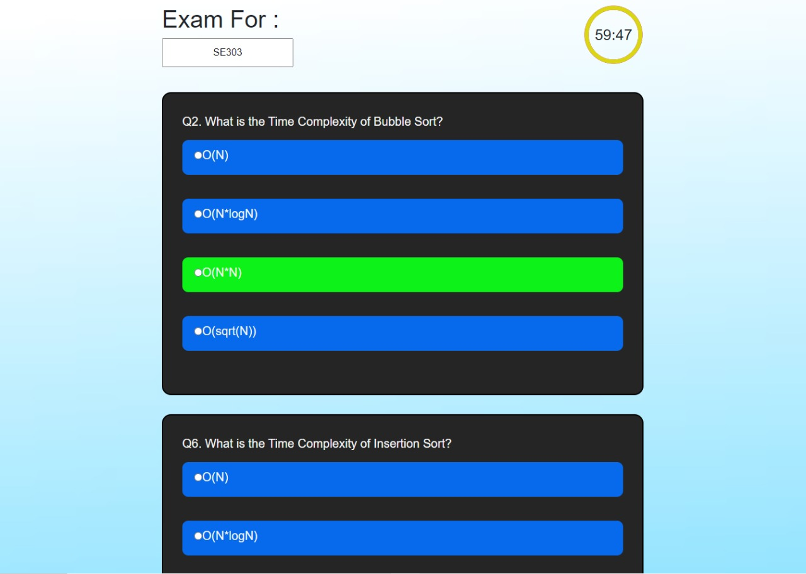

12) View Marks
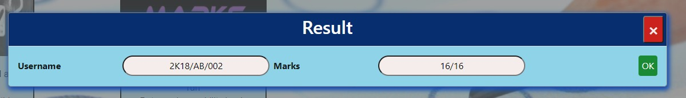
